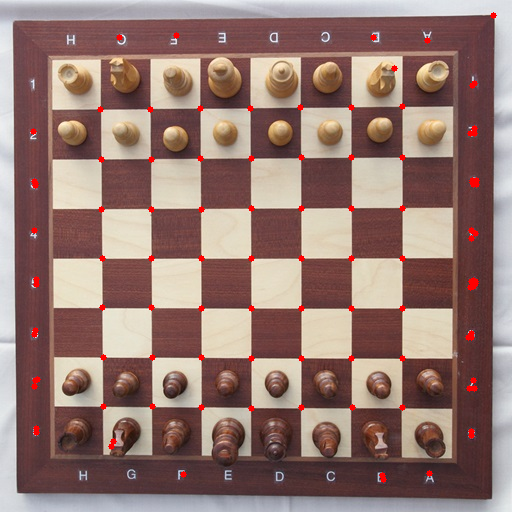

# Harris Corner Detector
Python implementation of Harris corner detector, a common corner detection operator in Computer Vision.


## Usage
Run [detector.py](detector.py) with argument(s) to perform corner detection.
```bash
python detector.py -i image_path [-h] [-s sigma] [-k kappa] [-t threshold] [-ks kernel_size]
```

### Arguments
| Parameter         | Default | Description                                   |
| ----------------- | ------- | --------------------------------------------- |
| -i --image_path   |         | File path of JPEG image to be detected        |
| -s --sigma        | 1.0     | Standard deviation of Gaussian kernel         |
| -k --kappa        | 0.04    | Constant in R matrix calculation              |
| -t --threshold    | 1e6     | Threshold of cornerness values                |
| -ks --kernel_size | 3       | Window size for Gaussian kernel (must be odd) |

### Example
Detect and plot the corners on `images/chessboard.jpg` with default setting.
```bash
python detector.py -i images/chessboard.jpg
```


</br>

Detect and plot the corners on `images/chessboard.jpg` with `kappa` = 0.05 and `threshold` = 2e6.
```bash
python detector.py -i images/chessboard.jpg -k 0.05 -t 2e6
```




## References
- [Chess board with chess set in opening position](https://commons.wikimedia.org/wiki/File:Chess_board_with_chess_set_in_opening_position_IMG_5994.JPG)
